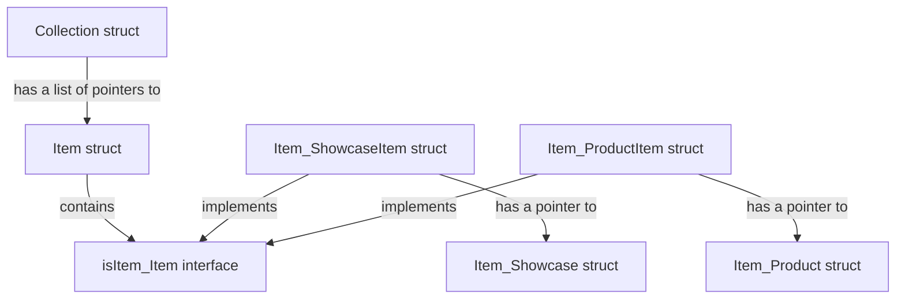

# A Simple PoC using Go Protobuf Repeated and OneOf

This Protobuf PoC illustrates the use of a repeated field where its value can have different data structures.
For that we use a proto message with a `repeated` field of another proto message that use a field with an `oneof`.

It was used [Buf](https://github.com/bufbuild/buf) CLI to generate Go Code from Protobuf, Buf also has a linter and formatter that was used in Protobuf files.

## Diagram



## Proto

```proto
syntax = "proto3";

package item.v2;
option go_package = "github.com/donwellus/go-protobuf-oneof/proto";

message Item {
  message Product {
    string sku = 1;
  }

  message Showcase {
    string pos = 1;
    string category = 2;
    string slug = 3;
  }

  oneof item {
    Product product_item = 1;
    Showcase showcase_item = 2;
  }
}

message Collection {
  repeated Item items = 1;
}
```

## Getting Started

Clone the repo, walk through the code and execute it: `go run main.go`

## A oneof cannot be repeated =P

- <https://protobuf.dev/programming-guides/proto/#oneof>
- <https://github.com/protocolbuffers/protobuf/issues/2592>
